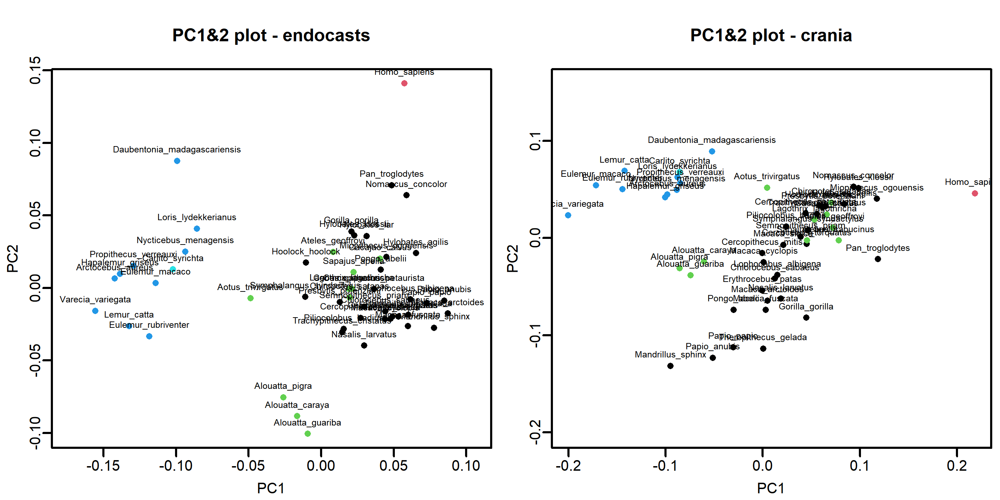
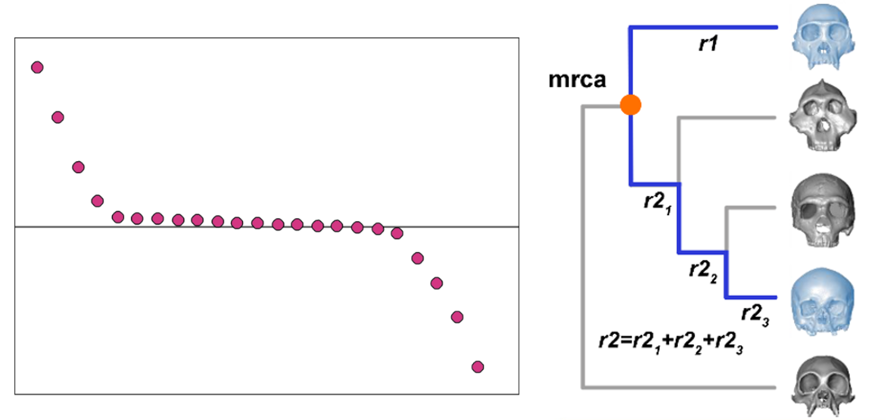
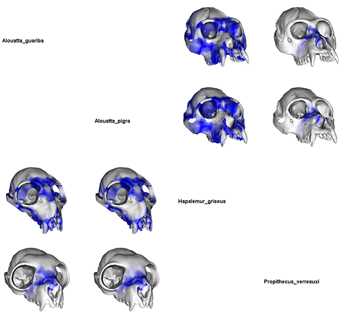
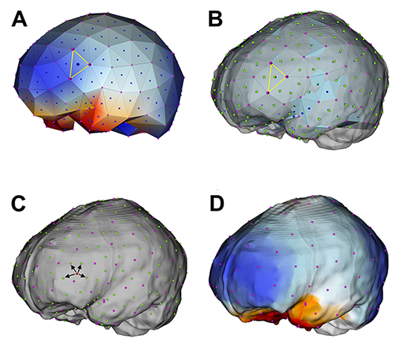

```{r, include = FALSE}
if (!requireNamespace("rmarkdown", quietly = TRUE) ||
     !rmarkdown::pandoc_available()) {
   warning(call. = FALSE, "Pandoc not found, the vignettes is not built")
   knitr::knit_exit()
}
misspacks<-sapply(c("rgl","Morpho","Rvcg"),requireNamespace,quietly=TRUE)
if(any(!misspacks)){
  warning(call. = FALSE,paste(names(misspacks)[which(!misspacks)],collapse=", "), "not found, the vignettes is not built")
   knitr::knit_exit()
}

knitr::opts_chunk$set(
  collapse = TRUE,
  comment = "#>")

options(rmarkdown.html_vignette.check_title = FALSE,mc.cores=2,rgl.useNULL=TRUE)
load("vignette_data.Rda")
library(RRmorph)
library(Morpho)
library(Rvcg)
library(rgl)
rgl::setupKnitr(autoprint = TRUE)
```

## Index
1. [RRmorph overview](#overview)
2. [Preparing the data](#preparation)
3. [The analysis of shape](#shape)
4. [rate.map](#rate)
5. [conv.map](#conv)
5. [interpol.mesh](#interpol)


## 1. RRmorph overview {#overview}
`RRmorph` is a comprehensive toolkit designed to investigate the effects of evolutionary rates and morphological convergence on phenotypes. The package integrates methodologies from Phylogenetic Comparative Methods (specifically, [`RRphylo`](https://CRAN.R-project.org/package=RRphylo), Castiglione et al. 2018) and Geometric Morphometrics to analyse shape evolution.

The functions embedded in `RRmorph` are landmarks-based. They allow to quantify and visualize the impact of rate variation and morphological convergence on three-dimensional shapes. Earlier versions of the two core functions of this package, `rate.map` and `conv.map`, were developed to map morphological changes onto reconstructed 3D meshes, based on landmarks positions in space (Melchionna et al. 2021; Castiglione et al. 2022).

The latest updates to `rate.map` and `conv.map` offer the possibility to map morphological changes onto real 3D surfaces provided by the user, preserving the resolution and detail of the original meshes.
As a 3D landmark-based toolkit, `RRmorph` requires 3D coordinate data obtained from 3D surfaces to register and analyze shape variation effectively.


## 2. Preparing the data {#preparation}
To illustrate the functionalities of `RRmorph`, we will use a subset of the supporting data published by Melchionna et al. (2024). The dataset consists of two different sets of three-dimensional landmarks collected on several specimens belonging to 51 living Primate species, including Catarrhini, Platyrrhini and Strepsirrhini. The first set includes 18 endocast landmarks, the second includes 41 landmarks sampled on cranial surfaces.

To run the examples, the user needs to load RRmorph data.
*RRmorphdata* object includes four different elements:

- dat.prima: a data frame with the specimens included in the example, their gender and the clade they belong to
- endo.set: a 3D array with the endocast landmarks and semilandmarks 
- crania.set: a 3D array with the cranial landmarks and semilandmarks
- tree.prima: phylogenetic tree of the species included in the examples


```{r loaddata, eval=FALSE}
library(RRmorph)
library(Morpho)
library(Rvcg)
library(rgl)
library(Arothron)

setwd("YOUR_DIRECTORY")
da<-"https://github.com/pasraia/RRmorph_example_data/raw/refs/heads/main/RRmorphdata.rda"
download.file(url=da,destfile = paste0(getwd(),"/RRmorphdata.rda"))
load(paste0(getwd(),"/RRmorphdata.rda"))

```


## 3. The analysis of shape {#shape}
Landmarks coordinates need to be analysed via usual GM procedures. This involves applying a Procrustes registration, which standardizes the coordinates by removing differences in size, position, and orientation. To reduce the dimensionality and explore the shape variation, the coordinates are elaborated by using Principal Component Analysis (PCA), or Relative Warp Analysis (RWA) if one is interested in separating the effect of the affine and non-affine variation (Schlager, 2017). The Principal Components (PCs) or the Relative Components (RWs) and their related scores serve as input data for the `RRmorph` functions.

There are different packages to perform the PCA or the RWA with GM data (i.e. [`Morpho`](https://CRAN.R-project.org/package=Morpho), [`geomorph`](https://CRAN.R-project.org/package=geomorph), [`shapes`](https://CRAN.R-project.org/package=shapes)). In this example, PCA is performed by using the function `procSym` in  `Morpho` (Schlager, 2017).

```{r pca, eval=FALSE}
pca_endo<-procSym(endo.set)
pca_cran<-procSym(crania.set)

plot(pca_endo$PCscores[,1:2],pch=16,col=as.factor(dat.prima$group),
     main = "PC1&2 plot - endocasts",asp = 1)
text(pca_endo$PCscores[,1:2],labels = dat.prima$species,pos = 3,cex=0.6)
plot(pca_cran$PCscores[,1:2],pch=16,col=as.factor(dat.prima$group),
     main = "PC1&2 plot - crania",asp=1)
text(pca_cran$PCscores[,1:2],labels = dat.prima$species,pos = 3,cex=0.6)
```
```{r pcplotfig,out.width='95%',dpi=300,echo=FALSE,fig.align='center'}

```

In the PC1/PC2 plot of the endocast shape, Strepsirrhini are clearly separated from Haplorrhini on PC1, except for  *Aotus trivirgatus*, which occupies an intermediate position between the two groups. Along the PC2, *Homo sapiens* and *Alouatta* stand  out placing at the two extremes of the axis. The clear partition between Haplorrini and Strepsirrhini is also evident along PC1 on the cranial shape. Cynocephaline primates (i.e., *Mandrillus*, *Papio*, *Theropithecus*) place opposite to Strepsirrhini along PC2. *Homo sapiens* is positioned towards one extreme of PC1.


## 4. `rate.map` {#rate}
The `rate.map` function is based on the evolutionary rate computations performed via `RRphylo` (Castiglione et al. 2018). The `RRphylo` method provides estimates of phenotypic rates per branch and reconstructs phenotypic values at internal nodes. It can handle both continuous and ordinal traits, as well as univariate and multivariate data (Castiglione et al. 2018, 2020).

Using vectors of Principal Component (PC) or Relative Warps (RW) scores, `rate.map` identifies the axes associated with the highest and lowest evolutionary rates and reconstructs the morphology weighted accordingly. This allows visualization of where and how phenotypic changes occurred most prominently between any given taxa under an evolutionary framework.

The algorithm operates by comparing either a single species/node or a pair of species/nodes. When two species or nodes are selected, they are compared to their most recent common ancestor; if a single species or node is chosen, it is compared to its immediate parental node. The rate values (one per PC/RW axis), along the evolutionary path of the selected species/nodes, are then ranked from highest to lowest.

```{r ratemapfig,out.width='95%',dpi=300,echo=FALSE}

```

The highest and lowest rates, along with their corresponding PC/RW axes, contribute most significantly to morphological variation from the ancestral to the descendant shapes. These axes are selected using the Extremum Distance Estimator (EDE) method (Christopoulos, 2022) implemented via the `ede` function ([`inflection`](https://CRAN.R-project.org/package=inflection) package). By using the selected PCs/RWs, a three-dimensional mesh is reconstructed, starting from the consensus shape. Since `RRphylo` can estimate the phenotype at nodes (aces), the surface of the ancestral shape is reconstructed as well, applying the *Ball Pivoting* algorithm (Bernardini et al. 1999; `vcgBallPivoting`, [`Rvcg`](https://CRAN.R-project.org/package=Rvcg) package). If no prior surface is provided, `rate.map` automatically performs this operation. The surface, however, can be also computed externally, using different software. In such cases, it is preferable to use the consensus shape configuration as a reference for reconstruction.

With `vcgBallPivoting`, the surface can be realized and visualized as follow:

```{r ballpivoting,fig.align="center",fig.dim=c(7,4),echo=c(-10)}
mshapeE<-vcgBallPivoting(pca_endo$mshape)
mshapeC<-vcgBallPivoting(pca_cran$mshape)

mfrow3d(nr=1,nc=2,sharedMouse=TRUE)
shade3d(mshapeE,col="lightgray",specular="black")
wire3d(mshapeE,col="black",specular="black")
next3d()
shade3d(mshapeC,col="lightgray",specular="black")
wire3d(mshapeC,col="black",specular="black")
```

The comparison between reconstructed shapes is based on a triangle-by-triangle area difference between the triangular meshes of each species/node and its most recent common ancestor. Since positive RRphylo rates means larger coordinate values, mesh triangles mapping to morphologically expanding areas will appear larger than their respective counterparts and vice versa. 

**Note**: the reconstructed surfaces of the compared species/nodes are intentionally altered, as the function utilizes only a subset of the morphological variation carried by the selected axes. This approach emphasizes which aspects of shape variation evolved most rapidly rather than using evolutionary rates to quantify the overall magnitude of phenotypic change.

In the following example, we first compute the evolutionary rates with `RRphylo` function (see [RRphylo vignette](https://CRAN.R-project.org/package=RRphylo/vignettes/RRphylo.html) for more details). This analysis relies on the phenotypic vectors retrieved earlier (i.e., *pca_endo* and *pca_cran* objects). Next, we run `rate.map` function to compare the endocasts of *Macaca mulatta* and *Homo sapiens*. Each species will be compared to its most recent common ancestor, generating two vectors of triangle by triangle area differences as the output. The length of the two vectors will be equal to the number of triangles composing the surfaces.

The reconstructed surfaces will be colored according to the area difference. The default color palette goes from dark red, which means area reduction, to dark blue, which conversely means area expansion. Zero values are always white.

```{r rrphylo, eval=FALSE}
PCscore_endo<-RRphylo::treedataMatch(tree.prima,pca_endo$PCscores)$y
RRendo<-RRphylo::RRphylo(tree.prima,PCscore_endo)

PCscore_cran<-RRphylo::treedataMatch(tree.prima,pca_cran$PCscores)$y
RRcran<-RRphylo::RRphylo(tree.prima,PCscore_cran)

rm_endo<-rate.map(x = c("Macaca_fuscata","Homo_sapiens"),
                  RR = RRendo,
                  scores = PCscore_endo,
                  pcs = pca_endo$PCs, 
                  mshape = pca_endo$mshape)

```
```{r rm_endo,fig.align="center",fig.dim=c(7,4),echo=FALSE}
mfrow3d(nr=1,nc=2,sharedMouse=TRUE)
shade3d(rm1sur[[1]],specular="black")
title3d(names(rm1sur)[1])
next3d()
shade3d(rm1sur[[2]],specular="black")
title3d(names(rm1sur)[2])
```
Whenever real surfaces are provided by the user, `rate.map` transfers the triangle by triangle area differences from the reconstructed surfaces to the three-dimensional meshes. To this aim, the landmarks/semilandmarks sets must be further provided to the function. 
The transfer is accomplished via interpolation. The interpolation algorithm is performed with `interpolMesh`, embedded in `RRmorph` package (see below for an extended explanation).
The real surfaces, and the related sets, must be provided as named lists.

```{r rate.map.plot, eval=FALSE}
endo.list<-arraytolist(endo.set[,,c("Macaca_fuscata","Homo_sapiens")])

rm_endoS<-rate.map(x = c("Macaca_fuscata","Homo_sapiens"),
                   RR = RRendo,
                   scores = PCscore_endo,
                   pcs = pca_endo$PCs, 
                   mshape = pca_endo$mshape,
                   refsur = endo.sur,
                   refmat = endo.list)

```

```{r rm_endoS,fig.align="center",fig.dim=c(7,4),echo=FALSE}
mfrow3d(nr=1,nc=2,sharedMouse=TRUE)
shade3d(rm2sur[[1]],specular="black")
title3d(names(rm2sur)[1])
next3d()
shade3d(rm2sur[[2]],specular="black")
title3d(names(rm2sur)[2])
```

## 5. `conv.map` {#conv}
Morphological convergence can be investigated using the function `conv.map`. A crucial prerequisite is that the user must have prior knowledge of which species or clades exhibit convergence to avoid potentially misleading inference. We strongly recommend running the function `search.conv` from the `RRphylo` package to identify convergent taxa before proceeding. The functioning and the interpretation of results of `search.conv` are described in Castiglione et al. 2019 and in the function [`vignette`](https://CRAN.R-project.org/package=RRphylo/vignettes/search.conv.html).

```{r search.conv, eval=FALSE}
SC<-search.conv(RR = RRcran, y = PCscore_cran) 
# Please note this result is not significant because we cut the data to reduce their size
```

`conv.map` requires phenotypic vectors (i.e., PC or RW scores) for the species under study. These vectors are computed relative to the origin of the PC axes (the consensus shape). The angle they form is a correlation coefficient. The angle ranges from 0° to 180°, according with the following:
-	an angle close to 0° indicates strong morphological convergence
-	angles around 90° suggests morphological dissimilarity
-	angles close to 180° indicate phenotypes evolving in opposite directions. 
`conv.map` computes angles between paired PC/RW vector by comparing two species at time. For each species pair, the function iteratively excludes one PC/RW at a time and recalculates the angle. If the angle increases after exclusion, it implies the excluded PC/RW contributes significantly to convergence, and is therefore retained. Conversely, if the angle decreases, the PC/RW is considered irrelevant to convergence and discarded.

Using the selected PCs/RWs, `conv.map` automatically reconstructs the three-dimensional shapes of the species pair under examination. These reconstructed surfaces are then compared to each other by calculating the triangle-by-triangle area differences, which are color-coded based on the amount of area difference. Regions without significant differences are assigned a by default a deep blue colour, shading towards white as the differences increase.

As explained in the `rate.map` section, if the user provides real surfaces along with their corresponding landmark sets, the algorithm will interpolate and transfer the computed area differences onto the real meshes and colour it accordingly.
Below, we provide an example using real surfaces. The arguments *x1* and *x2* specify the clades to be examined. If convergence is being assessed within a single clade, the user must specify the species to be plotted in *x1*. In this example, we investigate morphological convergence between howler monkeys (genus *Alouatta*) and Lemuroidea (see Melchionna et al. 2024). The species names entered in *x1* and *x2* correspond to those whose surfaces we wish to visualize for the best convergent areas.

```{r conv.map, eval=FALSE}
cran.list<-arraytolist(crania.set[,,c("Alouatta_guariba",
                                    "Alouatta_pigra",
                                    "Hapalemur_griseus",
                                    "Propithecus_verreauxi")])

cm_crann<-conv.map(x1=c("Alouatta_guariba","Alouatta_pigra"),
                   x2=c("Hapalemur_griseus","Propithecus_verreauxi"),
                   scores = PCscore_cran,pcs = pca_cran$PCs,
                   mshape = pca_cran$mshape,refmat = cran.list,refsur = crania.sur)

```

The resulting 3D plot will display a grid comparing two species at time, one from *x1* and one from *x2*, displayed in the upper and the lower triangle respectively.

```{r fig5,out.width='75%',echo=FALSE,fig.align="center"}

```

Besides the 3D visualization, `conv.map` provides additional outputs:

- angle.compare, a data frame of angles measurement, including the real angle between species vectors, the angle value after PC/RW selection, the angle difference, and the p-value for each comparison;

```{r angle.comp, echo=FALSE}
cm_crann$angle.compare
```

-	average.dist, data frame reporting the pairwise distance between the selected species.

```{r av.dist, echo=FALSE}
cm_crann$average.dist
```


## 6. `interpol.mesh` {#interpol}

The function `interpol.mesh` is embedded within both `rate.map` and `conv.map`. As a stand-alone tool `interpol.mesh` can be used to interpolate any vector of values from a reconstructed mesh (`sur` argument) to a real one (`refsur` argument), by using a set of landmarks as target (`refmat` argument). The values can be linked to either the triangles or the vertices of `sur`, as specified by the argument `element`. 
The algorithm starts by locating a set of points (NNps) on the real surface (`refsur`) provided by the user. Each NNps corresponds to a single nearest neighbor for each vertex of the reconstructed surface (or barycenter if `element="triangles"`). Interpolation is then performed by selecting the nearest-neighbor vertices for each point on the real surface and computing the weighted mean of their values based on distance. 

In the example below the values are associated to the triangles.
```{r interpolmesh,out.width='75%',fig.align="center",echo=FALSE}
 
```

The first step of the interpolation is computing the barycenter for each triangle of `sur` (blue dots in panel A) and linking the area difference value to its coordinates. The position of each barycenter is then approximated on `refsur` by selecting the nearest-neighbor vertex (green dot in panel B). This operation is possible because the real surfaces are superimposed to the reconstructed meshes. Then, for each point of `refsur` (red dot in panel C), the algorithm selects the closest projected barycenters (green dots). The mean value of the `k` adjoining points, weighted by the Euclidean distances is computed as to represent the interpolated value at the focal point. Note that by default `interpol.mesh` select `k=4` nearest neighbor points, but it can be changed by the user. `interpol.mesh` returns a vector of interpolated values as long as the number of triangles of the given real surfaces. Then the real surface can be colored by the function `col2mesh` (panel D).


## References
* Castiglione, S., Tesone, G., Piccolo, M., Melchionna, M., Mondanaro, A., Serio, C., Di Febbraro, M. & Raia, P. (2018). A new method for testing evolutionary rate variation and shifts in phenotypic evolution. Methods in Ecology and Evolution, 9(4), 974-983. doi.org/10.1111/2041-210X.12954.

* Melchionna, M., Profico, A., Castiglione, S., Serio, C., Mondanaro, A., Modafferi, M., Tamagnini, D., Maiorano, L. , Raia, P., Witmer, L.M., Wroe, S., & Sansalone, G. (2021). A method for mapping morphological convergence on three-dimensional digital models: the case of the mammalian sabre-tooth. Palaeontology, 64, 573–584. doi:10.1111/pala.12542

* Castiglione, S., Melchionna, M., Profico, A., Sansalone, G., Modafferi, M., Mondanaro, A., Wroe, S., Piras, P., & Raia, P. (2021). Human face-off: a new method for mapping evolutionary rates on three-dimensional digital models. Palaeontology, 65, e12582. doi:10.1111/pala.12582
  
* Melchionna, M., Castiglione, S., Girardi, G., Serio, C., Esposito, A., Mondanaro, A., Profico, A., Sansalone, G. & Raia, P. (2024). RRmorph—a new R package to map phenotypic evolutionary rates and patterns on 3D meshes. Communications Biology, 7(1), 1009. doi.org/10.1038/s42003-024-06710-8.

* Schlager, S. (2017). Morpho and Rvcg–shape analysis in R: R-packages for geometric morphometrics, shape analysis and surface manipulations. In Statistical shape and deformation analysis (pp. 217-256). Academic Press. doi.org/10.1016/B978-0-12-810493-4.00011-0

* Castiglione, S., Serio, C., Mondanaro, A., Melchionna, M., Carotenuto, F., Di Febbraro, M., Profico, A., Tamagnini, D. & Raia, P. (2020). Ancestral state estimation with phylogenetic ridge regression. Evolutionary Biology, 47(3), 220-232. doi.org/10.1007/s11692-020-09505-x

* Christopoulos, D.T. (2022). inflection: Finds the Inflection Point of a Curve. R package version 1.3.6. 

* Bernardini, F., Mittleman, J., Rushmeier, H., Silva, C., & Taubin, G. (1999). The ball-pivoting algorithm for surface reconstruction. IEEE transactions on visualization and computer graphics, 5(4), 349-359.

* Castiglione, S., Serio, C., Tamagnini, D., Melchionna, M., Mondanaro, A., Di Febbraro, M., Profico, A., Piras, P.,Barattolo, F., & Raia, P. (2019). A new, fast method to search for morphological convergence with shape data. PLoS ONE, 14, e0226949. doi:10.1371/journal.pone.0226949
